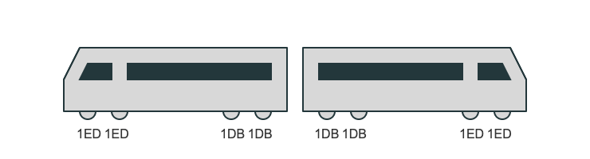

# Brake Calculations

This repository provides Jupyter Notebooks for brake calculations for rail vehicles.

## Using average values

This notebook is based on EN 14531-1 and implements an simplified example following appendix D. The example is a multiple unit with two coach and 8 axles:

## Time-step approach

The time step approach follows EN 14531-2 and adds an electrodynamical brake instead of the tread brakes in the average value example.

## Licensing

All code is available under MIT License.

## How to use

Both notebooks are available on Binder:

The full repository is available on GitHub: [https://github.com/RailProfAC/RailwayBrakeCalculation](https://github.com/RailProfAC/RailwayBrakeCalculation).
